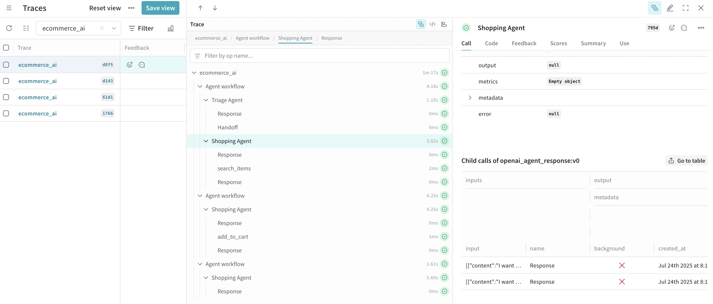

# E-Commerce AI System

The customer will interact with a general assistant to:

1. Shop for products
2. Place orders
3. Track or refund orders
4. Ask FAQs about store policies

Each function is handled by a specialized agent, and the Triage Agent decides where to route the user.

*NOTE: I created this to understand how to build an AI agentic system with Weights & Biases library. The E-Commerce idea was more flushed out with ChatGPT. I designed the rest based off W & B's Flight example and used Copilot to assist with example input queries.*

| Agent              | Responsibilities                                     | Tools                             |
| ------------------ | ---------------------------------------------------- | --------------------------------- |
| **Triage Agent**   | Analyze user's request & hand off to correct agent.  | N/A                               |
| **Shopping Agent** | Search items, filter by category, brand, price, etc. | `search_items`, `add_to_cart`     |
| **Order Agent**    | Confirm cart, place order, show order ref.           | `place_order`, `get_order_status` |
| **Refund Agent**   | Take return reason, create refund request.           | `submit_refund`                   |
| **FAQ Agent**      | General policies on shipping, returns, etc.          | `get_store_faq`                   |

## 🔁 Sample Handoff Flows
### 🔹 Flow 1: Browse and Buy
Prompt: “I want to buy Pokemon cards.”
Path: `Triage → Shopping Agent → Order Agent`
Tools: `search_items`, `add_to_cart`, `place_order`

#### Example with W and B Traces

```bash
Starting E-Commerce program...
weave: 🍩 https://wandb.ai/cadavezjoshua-none/ecommerce-ai/r/call/01983ef0-b466-7079-ad72-121b8fced8f5
Welcome to the E-Commerce AI System! How can I assist you today?
Type 'exit' or 'quit' to leave at any time.
> I want to buy Pokemon cards
[Shopping Agent] I found some options related to Pokemon:

1. Pikachu Plush
2. Charmander Figure

Could you please tell me which one you’d like to buy, or would you like to see more options specifically for Pokemon trading cards?
> I want the Charmander Figure
[Shopping Agent] The Charmander Figure has been added to your cart!

Would you like to continue shopping for more Pokemon items, or do you need any further assistance with your purchase?
> No, I'm good thank you
[Shopping Agent] You're welcome! If you need any more help in the future, just let me know. Have a great day and enjoy your Charmander Figure!
> exit
Thank you for using the E-Commerce AI System. Goodbye!
```


### 🔹 Flow 2: Check Order Status
Prompt: “What’s the status of my order ORD-9001?”
Path: `Triage → Order Agent`
Tool: `get_order_status`

#### Example with W and B Traces
```bash
Starting E-Commerce program...
weave: 🍩 https://wandb.ai/cadavezjoshua-none/ecommerce-ai/r/call/01983ef7-412f-7da4-b453-bc71727f8107
Welcome to the E-Commerce AI System! How can I assist you today?
Type 'exit' or 'quit' to leave at any time.
> What's the status of my order ORD-9001?
[Order Agent] The status of your order ORD-9001 is: in transit.

If you have any more questions or need help with another order, just let me know!
> Thank you that's all
[Order Agent] You’re welcome! If you need any help in the future, feel free to reach out. Have a great day! 😊
> exit
Thank you for using the E-Commerce AI System. Goodbye!
```


### 🔹 Flow 3: Refund
Prompt: “I want to return my blender because it’s broken.”
Path: `Triage → Refund Agent`
Tool: `submit_refund`

```bash
Starting E-Commerce program...
weave: 🍩 https://wandb.ai/cadavezjoshua-none/ecommerce-ai/r/call/01983efb-27d8-7d78-9c2b-4e7788a6b69c
Welcome to the E-Commerce AI System! How can I assist you today?
Type 'exit' or 'quit' to leave at any time.
> I want to return my blender because it’s broken.
[Refund Agent] I’m sorry to hear your blender is broken. I can help you with your return.

Could you please provide your order ID for the blender?
> ORD-9001
[Refund Agent] Thank you. Just to confirm, your return reason is "broken." Is that correct, or would you like to add any more details about the issue?
> This blender blends really really slow. Should blend super duper fast!
[Refund Agent] Your return request for the blender (Order ID: ORD-9001) has been submitted because it blends very slowly and should blend much faster.

Your refund reference is: RFD-102. You’ll receive a confirmation and next steps shortly. If you need further assistance, just let me know!
> exit
Thank you for using the E-Commerce AI System. Goodbye!
```


### 🔹 Flow 4: Ask About Return Policy
Prompt: “How long do I have to return something?”
Path: `Triage → FAQ Agent`
Tool: `get_store_faq("returns")`

```bash
Starting E-Commerce program...
weave: 🍩 https://wandb.ai/cadavezjoshua-none/ecommerce-ai/r/call/01983f00-9084-7772-bcd1-c519501c5c3b
Type 'exit' or 'quit' to leave at any time.
> How long do I have to return something?
[FAQ Agent] Hello! It looks like you're asking about how long you have to return something.

I'm sorry, but I couldn't find the specific return policy information. Would you like help with something else, or is there another question about returns you have in mind? If you know which store or website you're asking about, please let me know and I’ll try to help further!
> exit
Thank you for using the E-Commerce AI System. Goodbye!
```


### 🔹 Flow 5: Combo Flow
Prompt: “Buy a Charizard figure and tell me the return policy.”
Path: `Triage → Shopping Agent → Order Agent → FAQ Agent`
Tools: `search_items`, `add_to_cart`, `place_order`, `get_store_faq`

```bash
Starting E-Commerce program...
weave: 🍩 https://wandb.ai/cadavezjoshua-none/ecommerce-ai/r/call/01983f02-5d53-798a-b65a-fb6f84c5c9ff
Welcome to the E-Commerce AI System! How can I assist you today?
Type 'exit' or 'quit' to leave at any time.
> Buy a Charizard figure and tell me the return policy.                                     
[Shopping Agent] I found some related items, but it looks like there isn't an exact match for a Charizard figure right now. The closest option available is a "Charmander Figure."

Would you like to add the Charmander Figure to your cart instead, or would you prefer to search for something else?

Regarding the return policy: Most stores allow returns within 30 days if the item is unused and in its original packaging, but I can provide specific details once you select your item. Let me know how you'd like to proceed!
> Ok, I select Charmander Figure.
[Shopping Agent] The Charmander Figure has been added to your cart!

Regarding the return policy: Typically, you can return items within 30 days as long as they are unused and in their original packaging. If you need more detailed information or have specific questions about returns, let me know!

Would you like help with anything else—perhaps checking out, looking for another item, or more details on the return process?
> no thank you
[Shopping Agent] You’re welcome! If you need any more help in the future, just let me know. Have a great day and enjoy your Charmander Figure!
> exit
Thank you for using the E-Commerce AI System. Goodbye!
```


## Installation

1. **Clone the repository:**
    ```bash
    git clone https://github.com/TheBookKnight/ecommerce-ai-system.git
    cd ecommerce-ai-system
    ```

2. **Create and activate a virtual environment with all dependencies:**
    ```bash
    uv venv .venv
    uv sync
    ```

3. **Set up your environment variables:**
    Create a `.env` file in the project root with:
    ```env
    OPENAI_API_KEY=your_openai_api_key
    WANDB_API_KEY=your_wandb_api_key
    ```

## Prerequisites

- Python 3.11 or higher (note: issue with Python 3.13)
- [uv](https://github.com/astral-sh/uv) package manager (recommended for dependency management)
- OpenAI API key
- Weights & Biases (wandb) API key

## How to Use

1. **Start the Virtual Environment:**
    ```bash
    source .venv/bin/activate
    ```

2. **Run the Program**
    ```bash
    python ecommerce_program.py
    ```